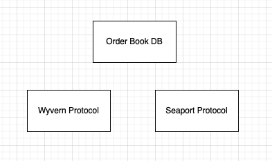

# Searport Analysis

## 概述

Seaport 的交易模型跟之前的 Wyvern Protocol 一样,依旧是中央订单簿的交易模型。都是由链下的中心化的订单簿和链上的交易组成。



其中链下的订单簿负责存储用户的挂单信息，并对订单进行撮合。最终的成交和转移 NFT 是由 Seaport Protocol 来负责的。

### 对比

我们都知道 Opensea 之前用的合约是 Wyvern Protocol。但是随着生态的发展 Wyvern Protocol 的各种问题开始暴露了出来。

1. 多年前开发的，代码最后维护的时间都是4年前了。
2. 不是专门为 Opensea 专门量身定做的，有大量的资源浪费。
3. gas 消耗多，280000左右（单个）。
4. 不支持直接使用代币购买 NFT，购买的时候需要转换。进一步提高了gas消耗和购买成本。

也正是为了解决这些问题 Seaport Protocol 被开发出来了。他有以下特性：

1. 支持批量购买，批量卖出。
2. 支持不同币种来购买。
3. 支持混合支付，比如订单可以设置成以一些 ERC20 代币加上某些 ERC721 代币来支付。主要目的是去除不同币种相互转换带来的损耗，进一步降低用户的额外费用。
4. 使用内联汇编来降低 gas 消耗，目前测试来看是 134000左右（单个）

我们可以看出 Seaport Protocol 最重要的目的就是降低用户的 gas 消耗并且降低购买流程的复杂度。

## 结构

```mermaid
graph TD
    Offer & Consideration --> Order
    zone & conduitKey --> Order

    subgraph Seaport[ ]
    Order --> Fulfill & Match
    Order --> Validate & Cancel
    end

    Validate --> Verify
    Cancel --> OrderStatus

    Fulfill & Match --> OrderCombiner --> OrderFulfiller

    OrderCombiner --> BasicOrderFulfiller --> OrderValidator
    OrderCombiner --> FulfillmentApplier

    OrderFulfiller --> CriteriaResolution
    OrderFulfiller --> AmountDeriver
    OrderFulfiller --> OrderValidator
    
    OrderValidator --> ZoneInteraction
    OrderValidator --> Executor --> TokenTransferrer
    Executor --> Conduit --> TokenTransferrer
    
    Executor --> Verify
    

    subgraph Verifiers[ ]
    Verify --> Time & Signature & OrderStatus
    end
```

上图是官方给出的结构解析图。

大致可以分为以下几个部分：

1. Order，订单相关数据结构
2. Order Fulfillment，订单撮合成交的方法
3. Verify，订单的校验
4. Transferrer，token 的转移

我们下面按照这个顺序来进行分析。

## Order


### offer 和 consideration

目前大多数 NFT 市场只允许一方同意提供 NFT，另一方同意提供支付代币的 listing。Seaport 采取了一种不同的方法：`offerer` 可以同意提供一定数量的 ETH/ERC20/ERC721/ERC1155 项目--这就是 `offer`。为了使该`offer`被接受，`offerer`必须收到一定数量的物品，这就是 "consideration"。

也就是说 Seaport 中没有明确的买家和卖家的概念了。

1. 当 offer 是 ERC721/ERC1155 的时候，offerer 就是卖家，卖出 ERC721/ERC1155 来换取 ETH/ERC20。
2. 当 offer 是 ETH/ERC20 的时候，offerer 就是买家，买入 ERC721/ERC1155，支付 ETH/ERC20。

需要注意的是 **ETH/ERC20 在 Seaport 中充当的是货币（currency），ERC721/ERC1155 充当的是商品。** 这一点很重要。

```solidity
// ConsiderationStructs.sol => 

struct OfferItem {
    ItemType itemType;
    address token;
    uint256 identifierOrCriteria;
    uint256 startAmount;
    uint256 endAmount;
}

struct ConsiderationItem {
    ItemType itemType;
    address token;
    uint256 identifierOrCriteria;
    uint256 startAmount;
    uint256 endAmount;
    address payable recipient;
}
```

#### itemType

需要注意的是 ERC721_WITH_CRITERIA 和 ERC1155_WITH_CRITERIA。表示基于标准的 ERC721/ERC1155。

配合 identifierOrCriteria 可以用来表示一个标准，代表一个多个 NFT的集合。具体后面再来说明。

#### token

token 的合约地址，空地址表示原生代币。

#### identifierOrCriteria

对于 ETH/ERC20 类型的 token，这个属性会被忽略。

对于 ERC721/ERC1155 类型的项目，表示 token id。

对于 ERC721_WITH_CRITERIA/ERC1155_WITH_CRITERIA 类型的项目表示的是一个 merkle tree 的 root 值。该 merkle tree 由一个指定的 token id 组成的集合来生成。

#### startAmount 和 endAmount

普通情况下这两个值是相同的。表示 token 的数量。

在进行荷兰式拍卖和英格兰式拍卖的时候，这两个值是不同的。然后订单根据当前这个两个属性并结合当前区块时间以及订单的 startTime、endTime 来确定当前的价格。

```solidity
// AmountDeriver.sol =>  _locateCurrentAmount()

// Derive the duration for the order and place it on the stack.
duration = endTime - startTime;

// Derive time elapsed since the order started & place on stack.
elapsed = block.timestamp - startTime;

// Derive time remaining until order expires and place on stack.
remaining = duration - elapsed;
```

#### recipient

consideration 需要指明 recipient。代表 token 的接收地址。

### offerer

order 里的 offer 的提供者。

需要注意的是，订单要是想要成交或者说想要转移 offerer 提供的 offer，必须是下面三个情况中的一个。

1. msg.sender == offerer，也就是卖家自己操作
2. 通过签名进行授权，标准的 65-byte EDCSA, 64-byte EIP-2098, 或者通过 EIP-1271 isValidSignature 的校验。大部分情况下是这种。
3. offerer 通过调用 validate() 进行链上挂单的。这种情况下订单成交的时候可以跳过签名的校验。

```solidity
// Consideration.sol => validate()

function validate(Order[] calldata orders)
        external
        override
        returns (bool validated)
    {
        // Validate the orders.
        validated = _validate(orders);
    }
```

### orderType

订单有四种类型：

1. FULL_OPEN

```solidity
// ConsiderationEnums.sol => 

enum OrderType {
    // 0: no partial fills, anyone can execute
    FULL_OPEN,

    // 1: partial fills supported, anyone can execute
    PARTIAL_OPEN,

    // 2: no partial fills, only offerer or zone can execute
    FULL_RESTRICTED,

    // 3: partial fills supported, only offerer or zone can execute
    PARTIAL_RESTRICTED
}
```

### zone


### conduit

### criteria


<!--  -->
